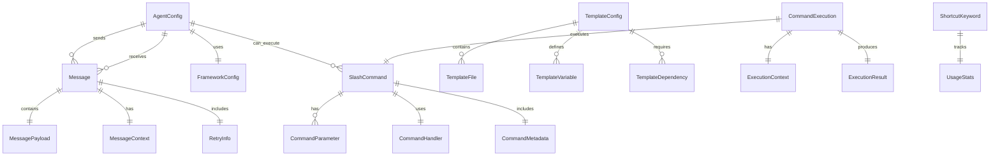

# Data Model Design: Multi-Agent System Slash Command Framework

**Date**: 2025-10-22
**Phase**: Phase 1 Design
**Status**: Draft

## Overview

This document defines the core data models and entity relationships for the Multi-Agent System Slash Command Framework. The design is based on the research findings from Phase 0 and addresses all functional requirements from the specification.

## Core Entities

### 1. Agent Configuration Model

```rust
use serde::{Deserialize, Serialize};
use std::collections::HashMap;
use uuid::Uuid;
use chrono::{DateTime, Utc};

/// Agent configuration structure
#[derive(Debug, Clone, Serialize, Deserialize, JsonSchema)]
pub struct AgentConfig {
    /// Unique identifier for the agent
    pub id: Uuid,

    /// Human-readable name
    pub name: String,

    /// Agent type and specialization
    pub agent_type: AgentType,

    /// Capabilities this agent provides
    pub capabilities: Vec<String>,

    /// Framework-specific configuration
    pub framework: FrameworkConfig,

    /// Communication preferences
    pub communication: CommunicationConfig,

    /// Resource limits and constraints
    pub resources: ResourceLimits,

    /// Work structure compliance rules
    pub work_structure: WorkStructureConfig,

    /// Agent-specific configuration overrides
    pub overrides: HashMap<String, serde_yaml::Value>,

    /// Creation and modification timestamps
    pub created_at: DateTime<Utc>,
    pub updated_at: DateTime<Utc>,
}

#[derive(Debug, Clone, Serialize, Deserialize, JsonSchema)]
pub enum AgentType {
    /// General purpose orchestration agent
    Orchestrator,

    /// Specialized development agent (coding, testing, etc.)
    Developer,

    /// Documentation and knowledge management agent
    Documenter,

    /// Code review and quality assurance agent
    Reviewer,

    /// Custom agent type with user-defined behavior
    Custom(String),
}

#[derive(Debug, Clone, Serialize, Deserialize, JsonSchema)]
pub struct FrameworkConfig {
    /// Target AI framework (Claude Code, Codex, Droid, etc.)
    pub framework: String,

    /// Framework-specific configuration
    pub settings: HashMap<String, serde_yaml::Value>,

    /// API endpoints and authentication
    pub api_config: ApiConfig,

    /// Model selection and parameters
    pub model_config: ModelConfig,
}

#[derive(Debug, Clone, Serialize, Deserialize, JsonSchema)]
pub struct ApiConfig {
    /// Base URL for the API
    pub base_url: String,

    /// Authentication method
    pub auth_method: AuthMethod,

    /// API key or token
    pub api_key: Option<String>,

    /// Additional headers
    pub headers: HashMap<String, String>,

    /// Request timeout in seconds
    pub timeout: u64,
}

#[derive(Debug, Clone, Serialize, Deserialize, JsonSchema)]
pub enum AuthMethod {
    /// No authentication
    None,

    /// API key in header
    ApiKey { header_name: String },

    /// Bearer token
    Bearer,

    /// Custom authentication scheme
    Custom { scheme: String },
}

#[derive(Debug, Clone, Serialize, Deserialize, JsonSchema)]
pub struct ModelConfig {
    /// Model name/identifier
    pub model: String,

    /// Maximum tokens for response
    pub max_tokens: Option<u32>,

    /// Temperature for randomness (0.0-1.0)
    pub temperature: Option<f32>,

    /// Top-p sampling
    pub top_p: Option<f32>,

    /// Custom model parameters
    pub parameters: HashMap<String, serde_yaml::Value>,
}

#[derive(Debug, Clone, Serialize, Deserialize, JsonSchema)]
pub struct CommunicationConfig {
    /// Preferred communication method
    pub method: CommunicationMethod,

    /// Message format preferences
    pub message_format: MessageFormat,

    /// Response timeout in seconds
    pub timeout: u64,

    /// Retry configuration
    pub retry_config: RetryConfig,

    /// Communication preferences
    pub preferences: CommunicationPreferences,
}

#[derive(Debug, Clone, Serialize, Deserialize, JsonSchema)]
pub enum CommunicationMethod {
    /// Direct message queue communication
    MessageQueue,

    /// Tmux command injection
    Tmux,

    /// File-based communication
    File,

    /// HTTP API communication
    Http,
}

#[derive(Debug, Clone, Serialize, Deserialize, JsonSchema)]
pub enum MessageFormat {
    /// Plain text messages
    PlainText,

    /// Structured JSON messages
    Json,

    /// YAML formatted messages
    Yaml,

    /// Custom format
    Custom(String),
}

#[derive(Debug, Clone, Serialize, Deserialize, JsonSchema)]
pub struct RetryConfig {
    /// Maximum number of retry attempts
    pub max_attempts: u32,

    /// Initial delay between retries in milliseconds
    pub initial_delay: u64,

    /// Backoff multiplier
    pub backoff_multiplier: f32,

    /// Maximum delay between retries in milliseconds
    pub max_delay: u64,
}

#[derive(Debug, Clone, Serialize, Deserialize, JsonSchema)]
pub struct CommunicationPreferences {
    /// Whether this agent prefers synchronous communication
    pub prefers_synchronous: bool,

    /// Maximum concurrent messages this agent can handle
    pub max_concurrent_messages: Option<u32>,

    /// Priority level for messages from this agent
    pub default_priority: MessagePriority,

    /// Whether this agent accepts broadcast messages
    pub accepts_broadcasts: bool,
}

#[derive(Debug, Clone, Serialize, Deserialize, JsonSchema)]
pub struct ResourceLimits {
    /// Maximum CPU usage percentage
    pub max_cpu_percent: Option<f32>,

    /// Maximum memory usage in MB
    pub max_memory_mb: Option<u32>,

    /// Maximum execution time in seconds
    pub max_execution_time: Option<u64>,

    /// Maximum concurrent tasks
    pub max_concurrent_tasks: Option<u32>,
}

#[derive(Debug, Clone, Serialize, Deserialize, JsonSchema)]
pub struct WorkStructureConfig {
    /// Work organization rules
    pub organization_rules: Vec<String>,

    /// File naming conventions
    pub file_conventions: FileConventions,

    /// Directory structure preferences
    pub directory_structure: DirectoryStructure,

    /// Code formatting preferences
    pub formatting: FormattingConfig,

    /// Validation rules
    pub validation_rules: Vec<ValidationRule>,
}

#[derive(Debug, Clone, Serialize, Deserialize, JsonSchema)]
pub struct FileConventions {
    /// File naming pattern
    pub naming_pattern: String,

    /// File extensions to use
    pub preferred_extensions: Vec<String>,

    /// Header template for files
    pub header_template: Option<String>,
}

#[derive(Debug, Clone, Serialize, Deserialize, JsonSchema)]
pub struct DirectoryStructure {
    /// Root directory name
    pub root_dir: String,

    /// Subdirectories to create
    pub subdirectories: Vec<String>,

    /// File placement rules
    pub file_placement_rules: HashMap<String, String>,
}

#[derive(Debug, Clone, Serialize, Deserialize, JsonSchema)]
pub struct FormattingConfig {
    /// Code formatter to use
    pub formatter: Option<String>,

    /// Line ending style
    pub line_endings: LineEndingStyle,

    /// Indentation style
    pub indentation: IndentationStyle,

    /// Maximum line length
    pub max_line_length: Option<u32>,
}

#[derive(Debug, Clone, Serialize, Deserialize, JsonSchema)]
pub enum LineEndingStyle {
    LF,    // Unix/Linux style
    CRLF,  // Windows style
    CR,    // Classic Mac style
    Native, // Platform native
}

#[derive(Debug, Clone, Serialize, Deserialize, JsonSchema)]
pub enum IndentationStyle {
    Spaces { count: u32 },
    Tabs,
}

#[derive(Debug, Clone, Serialize, Deserialize, JsonSchema)]
pub struct ValidationRule {
    /// Rule identifier
    pub id: String,

    /// Rule description
    pub description: String,

    /// Validation pattern or rule
    pub pattern: String,

    /// Whether this rule is required or recommended
    pub severity: RuleSeverity,
}

#[derive(Debug, Clone, Serialize, Deserialize, JsonSchema)]
pub enum RuleSeverity {
    Required,
    Recommended,
    Optional,
}
```

### 2. Message Communication Model

```rust
/// Core message structure for agent communication
#[derive(Debug, Clone, Serialize, Deserialize, JsonSchema)]
pub struct Message {
    /// Unique message identifier
    pub id: Uuid,

    /// Sender agent identifier
    pub sender: Uuid,

    /// Recipient agent identifier (None for broadcast)
    pub recipient: Option<Uuid>,

    /// Message type
    pub message_type: MessageType,

    /// Message payload
    pub payload: MessagePayload,

    /// Message timestamp
    pub timestamp: DateTime<Utc>,

    /// Message priority
    pub priority: MessagePriority,

    /// Retry information
    pub retry_info: RetryInfo,

    /// Context information
    pub context: MessageContext,

    /// Metadata
    pub metadata: HashMap<String, serde_json::Value>,
}

#[derive(Debug, Clone, Serialize, Deserialize, JsonSchema)]
pub enum MessageType {
    /// Command execution request
    Command,

    /// Response to a command
    Response,

    /// Status update notification
    StatusUpdate,

    /// Error notification
    Error,

    /// Heartbeat/ping message
    Heartbeat,

    /// Context sharing request
    ContextRequest,

    /// Context sharing response
    ContextResponse,

    /// Custom message type
    Custom(String),
}

#[derive(Debug, Clone, Serialize, Deserialize, JsonSchema)]
pub enum MessagePayload {
    /// Command execution payload
    Command(CommandPayload),

    /// Response payload
    Response(ResponsePayload),

    /// Status update payload
    Status(StatusPayload),

    /// Error payload
    Error(ErrorPayload),

    /// Heartbeat payload
    Heartbeat(HeartbeatPayload),

    /// Context payload
    Context(ContextPayload),

    /// Custom payload
    Custom(serde_json::Value),
}

#[derive(Debug, Clone, Serialize, Deserialize, JsonSchema)]
pub struct CommandPayload {
    /// Command to execute
    pub command: String,

    /// Command arguments
    pub args: Vec<String>,

    /// Working directory
    pub working_dir: Option<String>,

    /// Environment variables
    pub env_vars: HashMap<String, String>,

    /// Execution timeout
    pub timeout: Option<u64>,

    /// Expected output format
    pub output_format: OutputFormat,
}

#[derive(Debug, Clone, Serialize, Deserialize, JsonSchema)]
pub enum OutputFormat {
    PlainText,
    Json,
    Yaml,
    Structured,
}

#[derive(Debug, Clone, Serialize, Deserialize, JsonSchema)]
pub struct ResponsePayload {
    /// Original message ID this responds to
    pub original_message_id: Uuid,

    /// Exit code from command execution
    pub exit_code: i32,

    /// Standard output
    pub stdout: String,

    /// Standard error
    pub stderr: String,

    /// Execution metrics
    pub metrics: ExecutionMetrics,

    /// Additional result data
    pub result_data: Option<serde_json::Value>,
}

#[derive(Debug, Clone, Serialize, Deserialize, JsonSchema)]
pub struct ExecutionMetrics {
    /// Start time
    pub start_time: DateTime<Utc>,

    /// End time
    pub end_time: DateTime<Utc>,

    /// Total duration in milliseconds
    pub duration_ms: u64,

    /// CPU usage percentage
    pub cpu_usage: Option<f32>,

    /// Memory usage in MB
    pub memory_usage: Option<f32>,

    /// Resource usage details
    pub resource_usage: ResourceUsage,
}

#[derive(Debug, Clone, Serialize, Deserialize, JsonSchema)]
pub struct ResourceUsage {
    /// CPU usage percentage
    pub cpu_percent: f32,

    /// Memory usage in MB
    pub memory_mb: f32,

    /// Disk usage in MB
    pub disk_mb: f32,

    /// Network usage in bytes
    pub network_bytes: u64,
}

#[derive(Debug, Clone, Serialize, Deserialize, JsonSchema)]
pub struct StatusPayload {
    /// Agent status
    pub status: AgentStatus,

    /// Current activity
    pub current_activity: Option<String>,

    /// Health metrics
    pub health_metrics: HealthMetrics,

    /// Queue information
    pub queue_info: QueueInfo,
}

#[derive(Debug, Clone, Serialize, Deserialize, JsonSchema)]
pub enum AgentStatus {
    /// Agent is idle and ready for work
    Idle,

    /// Agent is currently processing a task
    Busy,

    /// Agent is temporarily unavailable
    Away,

    /// Agent has encountered an error
    Error,

    /// Agent is shutting down
    ShuttingDown,
}

#[derive(Debug, Clone, Serialize, Deserialize, JsonSchema)]
pub struct HealthMetrics {
    /// Last heartbeat time
    pub last_heartbeat: DateTime<Utc>,

    /// Response time in milliseconds
    pub response_time_ms: u64,

    /// Error rate (0.0-1.0)
    pub error_rate: f32,

    /// Uptime percentage (0.0-1.0)
    pub uptime_percentage: f32,
}

#[derive(Debug, Clone, Serialize, Deserialize, JsonSchema)]
pub struct QueueInfo {
    /// Number of messages in queue
    pub queue_size: u32,

    /// Average processing time in milliseconds
    pub avg_processing_time_ms: u64,

    /// Number of processed messages
    pub processed_count: u64,

    /// Number of failed messages
    pub failed_count: u64,
}

#[derive(Debug, Clone, Serialize, Deserialize, JsonSchema)]
pub struct ErrorPayload {
    /// Error code
    pub code: String,

    /// Error message
    pub message: String,

    /// Error details
    pub details: Option<String>,

    /// Stack trace if available
    pub stack_trace: Option<String>,

    /// Error context
    pub context: HashMap<String, serde_json::Value>,
}

#[derive(Debug, Clone, Serialize, Deserialize, JsonSchema)]
pub struct HeartbeatPayload {
    /// Agent status
    pub status: AgentStatus,

    /// Current timestamp
    pub timestamp: DateTime<Utc>,

    /// Optional status message
    pub message: Option<String>,
}

#[derive(Debug, Clone, Serialize, Deserialize, JsonSchema)]
pub struct ContextPayload {
    /// Context type
    pub context_type: ContextType,

    /// Context data
    pub data: serde_json::Value,

    /// Context version
    pub version: String,

    /// Expiration time (if applicable)
    pub expires_at: Option<DateTime<Utc>>,
}

#[derive(Debug, Clone, Serialize, Deserialize, JsonSchema)]
pub enum ContextType {
    /// Project context (files, structure, etc.)
    Project,

    /// Conversation context (chat history)
    Conversation,

    /// Agent state context
    AgentState,

    /// Configuration context
    Configuration,

    /// Custom context type
    Custom(String),
}

#[derive(Debug, Clone, Serialize, Deserialize, JsonSchema)]
pub enum MessagePriority {
    Low,
    Normal,
    High,
    Critical,
}

#[derive(Debug, Clone, Serialize, Deserialize, JsonSchema)]
pub struct RetryInfo {
    /// Current retry attempt
    pub attempt: u32,

    /// Maximum retry attempts
    pub max_attempts: u32,

    /// Next retry time
    pub next_retry_at: Option<DateTime<Utc>>,

    /// Retry reason
    pub reason: Option<String>,
}

#[derive(Debug, Clone, Serialize, Deserialize, JsonSchema)]
pub struct MessageContext {
    /// Session identifier
    pub session_id: Uuid,

    /// Request chain (for correlated messages)
    pub chain: Vec<Uuid>,

    /// User context
    pub user_context: Option<UserContext>,

    /// Project context
    pub project_context: Option<ProjectContext>,
}

#[derive(Debug, Clone, Serialize, Deserialize, JsonSchema)]
pub struct UserContext {
    /// User identifier
    pub user_id: String,

    /// User preferences
    pub preferences: HashMap<String, serde_json::Value>,

    /// User permissions
    pub permissions: Vec<String>,
}

#[derive(Debug, Clone, Serialize, Deserialize, JsonSchema)]
pub struct ProjectContext {
    /// Project identifier
    pub project_id: Uuid,

    /// Project name
    pub project_name: String,

    /// Current working directory
    pub working_dir: String,

    /// Git branch
    pub git_branch: Option<String>,

    /// Project metadata
    pub metadata: HashMap<String, serde_json::Value>,
}
```

### 3. Slash Command Model

```rust
/// Slash command definition
#[derive(Debug, Clone, Serialize, Deserialize, JsonSchema)]
pub struct SlashCommand {
    /// Command identifier
    pub id: Uuid,

    /// Command name (without slash)
    pub name: String,

    /// Command description
    pub description: String,

    /// Command usage syntax
    pub usage: String,

    /// Command parameters
    pub parameters: Vec<CommandParameter>,

    /// Command handler
    pub handler: CommandHandler,

    /// Command category
    pub category: CommandCategory,

    /// Required permissions
    pub permissions: Vec<String>,

    /// Framework compatibility
    pub framework_compatibility: Vec<String>,

    /// Command metadata
    pub metadata: CommandMetadata,
}

#[derive(Debug, Clone, Serialize, Deserialize, JsonSchema)]
pub struct CommandParameter {
    /// Parameter name
    pub name: String,

    /// Parameter description
    pub description: String,

    /// Parameter type
    pub param_type: ParameterType,

    /// Whether this parameter is required
    pub required: bool,

    /// Default value if not provided
    pub default_value: Option<serde_json::Value>,

    /// Validation rules
    pub validation: Option<ValidationRule>,

    /// Parameter position (for positional arguments)
    pub position: Option<u32>,
}

#[derive(Debug, Clone, Serialize, Deserialize, JsonSchema)]
pub enum ParameterType {
    /// String parameter
    String,

    /// Integer parameter
    Integer,

    /// Float parameter
    Float,

    /// Boolean parameter
    Boolean,

    /// List parameter
    List { item_type: Box<ParameterType> },

    /// Object parameter
    Object { properties: HashMap<String, ParameterType> },

    /// Enum parameter
    Enum { options: Vec<String> },

    /// File path parameter
    FilePath,

    /// URL parameter
    Url,
}

#[derive(Debug, Clone, Serialize, Deserialize, JsonSchema)]
pub enum CommandHandler {
    /// Built-in command handler
    BuiltIn { function: String },

    /// External script handler
    Script { path: String, interpreter: Option<String> },

    /// Plugin handler
    Plugin { plugin_name: String, handler: String },

    /// HTTP API handler
    Api { url: String, method: String },

    /// Agent communication handler
    Agent { agent_id: Uuid, command: String },
}

#[derive(Debug, Clone, Serialize, Deserialize, JsonSchema)]
pub enum CommandCategory {
    /// Agent management commands
    AgentManagement,

    /// Communication commands
    Communication,

    /// Configuration commands
    Configuration,

    /// Project management commands
    ProjectManagement,

    /// Template commands
    Template,

    /// Utility commands
    Utility,

    /// Custom category
    Custom(String),
}

#[derive(Debug, Clone, Serialize, Deserialize, JsonSchema)]
pub struct CommandMetadata {
    /// Command version
    pub version: String,

    /// Author information
    pub author: String,

    /// Creation date
    pub created_at: DateTime<Utc>,

    /// Last modified date
    pub modified_at: DateTime<Utc>,

    /// Tags
    pub tags: Vec<String>,

    /// Examples
    pub examples: Vec<String>,

    /// Related commands
    pub related_commands: Vec<String>,
}

/// Command execution result
#[derive(Debug, Clone, Serialize, Deserialize, JsonSchema)]
pub struct CommandExecution {
    /// Execution identifier
    pub id: Uuid,

    /// Command that was executed
    pub command: Uuid,

    /// Parameters used
    pub parameters: HashMap<String, serde_json::Value>,

    /// Execution context
    pub context: ExecutionContext,

    /// Execution result
    pub result: ExecutionResult,

    /// Performance metrics
    pub metrics: ExecutionMetrics,

    /// Execution timestamp
    pub timestamp: DateTime<Utc>,
}

#[derive(Debug, Clone, Serialize, Deserialize, JsonSchema)]
pub struct ExecutionContext {
    /// User who executed the command
    pub user_id: String,

    /// Working directory
    pub working_dir: String,

    /// Environment variables
    pub environment: HashMap<String, String>,

    /// Framework being used
    pub framework: String,

    /// Session identifier
    pub session_id: Uuid,
}

#[derive(Debug, Clone, Serialize, Deserialize, JsonSchema)]
pub enum ExecutionResult {
    /// Successful execution
    Success { output: String, data: Option<serde_json::Value> },

    /// Failed execution
    Error { error: String, code: String },

    /// Partial success
    Partial { output: String, warnings: Vec<String> },

    /// Execution timed out
    Timeout { duration: u64 },
}

/// Shortcut keyword definition
#[derive(Debug, Clone, Serialize, Deserialize, JsonSchema)]
pub struct ShortcutKeyword {
    /// Shortcut identifier
    pub id: Uuid,

    /// Keyword/alias
    pub keyword: String,

    /// Expansion pattern
    pub expansion: String,

    /// Parameters for the expansion
    pub parameters: Vec<String>,

    /// Description
    pub description: String,

    /// Whether this shortcut is active
    pub active: bool,

    /// Usage statistics
    pub usage_stats: UsageStats,

    /// Creation and modification timestamps
    pub created_at: DateTime<Utc>,
    pub updated_at: DateTime<Utc>,
}

#[derive(Debug, Clone, Serialize, Deserialize, JsonSchema)]
pub struct UsageStats {
    /// Number of times used
    pub usage_count: u64,

    /// Last used timestamp
    pub last_used: Option<DateTime<Utc>>,

    /// Average execution time
    pub avg_execution_time_ms: Option<u64>,
}
```

### 4. Template System Model

```rust
/// Template configuration
#[derive(Debug, Clone, Serialize, Deserialize, JsonSchema)]
pub struct TemplateConfig {
    /// Template identifier
    pub id: Uuid,

    /// Template name
    pub name: String,

    /// Template description
    pub description: String,

    /// Template version
    pub version: String,

    /// Template files
    pub files: Vec<TemplateFile>,

    /// Template variables
    pub variables: Vec<TemplateVariable>,

    /// Template dependencies
    pub dependencies: Vec<TemplateDependency>,

    /// Template metadata
    pub metadata: TemplateMetadata,
}

#[derive(Debug, Clone, Serialize, Deserialize, JsonSchema)]
pub struct TemplateFile {
    /// Source path in template
    pub source_path: String,

    /// Destination path in project
    pub destination_path: String,

    /// File content or template content
    pub content: FileContent,

    /// File permissions
    pub permissions: Option<u32>,

    /// Whether this file should be processed as a template
    pub is_template: bool,
}

#[derive(Debug, Clone, Serialize, Deserialize, JsonSchema)]
pub enum FileContent {
    /// Static file content
    Static(String),

    /// Template content with variables
    Template(String),

    /// Binary content (base64 encoded)
    Binary(String),

    /// Reference to external file
    External { path: String, url: Option<String> },
}

#[derive(Debug, Clone, Serialize, Deserialize, JsonSchema)]
pub struct TemplateVariable {
    /// Variable name
    pub name: String,

    /// Variable description
    pub description: String,

    /// Variable type
    pub var_type: VariableType,

    /// Default value
    pub default_value: Option<serde_json::Value>,

    /// Whether this variable is required
    pub required: bool,

    /// Validation rules
    pub validation: Option<ValidationRule>,
}

#[derive(Debug, Clone, Serialize, Deserialize, JsonSchema)]
pub enum VariableType {
    String,
    Integer,
    Float,
    Boolean,
    List { item_type: Box<VariableType> },
    Object { properties: HashMap<String, VariableType> },
    Enum { options: Vec<String> },
}

#[derive(Debug, Clone, Serialize, Deserialize, JsonSchema)]
pub struct TemplateDependency {
    /// Dependency name
    pub name: String,

    /// Dependency version requirement
    pub version_requirement: String,

    /// Whether this dependency is optional
    pub optional: bool,

    /// Installation command if needed
    pub install_command: Option<String>,
}

#[derive(Debug, Clone, Serialize, Deserialize, JsonSchema)]
pub struct TemplateMetadata {
    /// Template author
    pub author: String,

    /// Template license
    pub license: Option<String>,

    /// Template tags
    pub tags: Vec<String>,

    /// Template category
    pub category: String,

    /// Minimum requirements
    pub requirements: Requirements,

    /// Creation and modification timestamps
    pub created_at: DateTime<Utc>,
    pub updated_at: DateTime<Utc>,
}

#[derive(Debug, Clone, Serialize, Deserialize, JsonSchema)]
pub struct Requirements {
    /// Minimum Rust version
    pub rust_version: Option<String>,

    /// Required system dependencies
    pub system_dependencies: Vec<String>,

    /// Required cargo dependencies
    pub cargo_dependencies: Vec<String>,

    /// Platform requirements
    pub platforms: Vec<String>,
}
```

## Entity Relationships



## Validation Rules

### Agent Configuration Validation
1. **Required Fields**: id, name, agent_type, framework
2. **Unique Constraints**: agent name must be unique within project
3. **Format Validation**: URLs must be valid, UUIDs must be properly formatted
4. **Range Validation**: timeouts must be positive, percentages between 0-100

### Message Validation
1. **Required Fields**: id, sender, message_type, payload, timestamp
2. **Size Limits**: messages must be under 10MB
3. **Format Validation**: timestamps must be valid ISO 8601
4. **Consistency Checks**: recipient must be valid agent ID if specified

### Command Validation
1. **Required Fields**: id, name, description, handler
2. **Naming Conventions**: command names must be lowercase alphanumeric with hyphens
3. **Parameter Validation**: required parameters must have validation rules
4. **Security**: command handlers must be validated for security risks

## State Transitions

### Agent Status Transitions
```
Idle -> Busy (when processing task)
Busy -> Idle (when task completes)
Busy -> Error (when task fails)
Error -> Idle (when error is resolved)
Idle -> Away (when agent goes inactive)
Away -> Idle (when agent returns)
Any -> ShuttingDown (when shutting down)
```

### Message Status Transitions
```
Queued -> Processing (when picked up by agent)
Processing -> Completed (when successfully processed)
Processing -> Failed (when processing fails)
Failed -> Queued (when retry is scheduled)
Failed -> DeadLetter (when max retries exceeded)
```

## Indexing Strategy

### Database Indexes
1. **AgentConfig**:
   - Primary key: id
   - Unique index: name
   - Index: agent_type, framework.framework

2. **Message**:
   - Primary key: id
   - Index: sender, recipient, timestamp, message_type
   - Composite index: (recipient, timestamp) for efficient retrieval

3. **CommandExecution**:
   - Primary key: id
   - Index: command, timestamp, context.user_id
   - Composite index: (context.session_id, timestamp)

4. **SlashCommand**:
   - Primary key: id
   - Unique index: name
   - Index: category, permissions

## Performance Considerations

### Message Queue Optimization
- **Batch Processing**: Process multiple messages together when possible
- **Priority Queuing**: Process high-priority messages first
- **Connection Pooling**: Reuse connections for external API calls
- **Caching**: Cache frequently accessed configuration data

### Memory Management
- **Message Streaming**: Stream large message payloads instead of loading entirely
- **Garbage Collection**: Implement periodic cleanup of old messages and logs
- **Resource Limits**: Enforce memory limits per agent

### Scalability Patterns
- **Horizontal Scaling**: Support multiple agent instances
- **Load Balancing**: Distribute messages across available agents
- **Circuit Breakers**: Prevent cascade failures when agents are unavailable

This data model provides a comprehensive foundation for implementing the Multi-Agent System Slash Command Framework while addressing all functional requirements and ensuring scalability and maintainability.